# Architecture

> **Last Updated:** November 30, 2025  
> **Version:** Alpha  
> **[← Back to README](README.md)**

## 📋 Table of Contents

- [Overview](#mnemosyne-ai-powered-jvm-heap-analysis-tool-rust)
- [Project Description and Goals](#project-description-and-goals)
- [System Architecture Overview](#system-architecture-overview-layered-design)
  - [Layer Responsibilities](#layer-responsibilities)
- [Component Breakdown](#component-breakdown)
  - [1. Command-Line Interface (CLI)](#1-command-line-interface-cli)
  - [2. Master Control Program (MCP)](#2-master-control-program-orchestrator---mcp)
  - [3. Heap Dump Parser](#3-heap-dump-parser-data-collector)
  - [4. AI Analysis Engine](#4-ai-analysis-engine-insight-generator)
  - [5. LLM Integration Module](#5-llm-integration-module-ai-service-connector)
  - [6. Report Generator](#6-report-generator-output-formatter)
- [Execution Flow](#execution-flow-from-cli-to-ai-and-back)
- [Integration Points](#integration-points)
- [Future Extension Points](#future-extension-points)
- [Modular Design Rationale](#modular-design-rationale)
- [References](#references)

---

## Mnemosyne: AI-Powered JVM Heap Analysis Tool (Rust)

Mnemosyne is an AI-driven Java heap analysis tool designed to help developers quickly diagnose memory issues in JVM applications. Named after the Greek goddess of memory, Mnemosyne combines high-performance Rust parsing with intelligent insights from language models. The goal is to process even enormous heap dumps efficiently and provide human-friendly analysis of potential memory leaks, high memory usage, and optimization opportunities. By leveraging AI, Mnemosyne doesn't just list statistics – it explains why memory is used and suggests how to improve it, all in a developer-friendly report.

## Project Description and Goals

Mnemosyne aims to be a one-stop solution for analyzing Java heap dumps (HPROF files) and pinpointing memory problems. Key objectives include:

**Handle Huge Dumps Efficiently**: Parse and analyze heap dumps that may exceed host RAM by streaming the data instead of loading it all at once. This ensures low memory overhead and allows quick analysis of multi-GB dumps.

**AI-Assisted Insights**: Utilize Large Language Models (LLMs) to interpret memory usage patterns. Instead of manually sifting through heap stats, the tool summarizes findings and highlights anomalies or leak suspects in plain language.

**Developer-Friendly Reporting**: Present results with clear summaries, class rankings, and actionable suggestions (e.g. which objects to investigate, potential root causes of leaks). Output is available in multiple formats (terminal, Markdown, JSON) for easy consumption.

**Seamless Integration**: Offer a simple CLI interface that can integrate into CI pipelines or dev workflows. A JSON output can enable automated checks (for memory regressions) in build pipelines, while Markdown reports can be attached to bug tickets for context.

**Modularity and Extensibility**: Provide a clean architecture where components (parsers, analysis rules, AI prompts, output formatters) are modular. This makes it easy to extend Mnemosyne with new analysis plugins or adapt it to future needs without touching core logic.

By meeting these goals, Mnemosyne helps engineers identify memory leaks, understand heap composition, and save time in debugging complex Java applications.

## System Architecture Overview (Layered Design)

Mnemosyne's architecture is organized into clear layers, separating the concerns of user interaction, orchestration, analysis, and external integration. This layered design improves maintainability and allows independent evolution of components (for example, swapping the AI backend or parser without affecting other parts). Below is a high-level overview of the system structure:



### Layer Responsibilities:

**Presentation Layer**: The CLI is the entry point, handling user input (CLI arguments, commands) and displaying output or saving reports.

**Control Layer**: The Master Control Program (MCP) is the coordinator that manages the overall workflow. It invokes parsing, triggers AI analysis, and consolidates results for reporting.

**Analysis Layer**: The core logic resides here. The Heap Dump Parser processes the raw heap dump efficiently in Rust, extracting key information. The AI Analysis Engine formulates questions/tasks for the AI and interprets its responses. The Report Generator formats the final analysis for the user.

**Integration Layer**: External services and extension points. For example, the LLM API module integrates with an AI service (e.g. OpenAI's GPT-4 or a local model) to get insights. Other integration points (like CI or IDE plugins) could also interface at this layer.

This layered architecture ensures that each concern (UI, orchestration, analysis, AI integration) can be developed and tested in isolation. It also makes it easier to swap out layers (for instance, using a different AI model or adding a GUI on top of the CLI) without rewriting the entire system.

## Component Breakdown

Mnemosyne is divided into modular components, each with a focused responsibility. Below is a breakdown of all major components and their roles in the system:

### 1. Command-Line Interface (CLI)

The CLI is the user-facing component: it parses command-line arguments and provides commands such as `mnemosyne analyze <heapdump>` or `mnemosyne report <options>`. Responsibilities include:

**Argument Parsing & Config**: Reading options (e.g. output format selection, AI model settings, filters) – likely using a crate like clap for ergonomic CLI design.

**User Commands**: Handling subcommands for different actions. For example, `analyze` to perform a full analysis on a heap dump, or `summary` to quickly list top memory consumers.

**Triggering Workflow**: After parsing inputs, the CLI invokes the MCP to perform the requested operation. It essentially hands off control along with user-provided parameters (file path, config flags).

**Output & UX**: Once results are ready, the CLI presents them to the user. This could mean printing a human-readable report to stdout, writing a Markdown file, or emitting TOON (our compact Token-Oriented Outline Notation) to stdout via `--format toon`. The CLI ensures the output is accessible (with coloring or section headers in terminal output, etc.).

**Rationale**: Keeping the CLI logic separate means the core analysis can be reused in other contexts (for example, as a library or in a service). The CLI is thin – it mainly delegates to the MCP and then formats output back to the user.

### 2. Master Control Program (Orchestrator - MCP)

The Master Control Program (MCP) is the brain of Mnemosyne's runtime. It orchestrates the end-to-end flow of data through the system:

**Initialization**: Validates inputs (e.g. checks that the heap dump file is accessible) and loads any necessary configuration (like API keys for the AI, analysis task definitions, etc.).

**Coordinating Modules**: Calls the Heap Dump Parser to process the dump and waits for the structured data results. It then passes the parsed data to the AI Analysis Engine for further interpretation.

**Workflow Management**: Ensures the steps occur in order, and handles errors at each stage (e.g. if parsing fails or the AI call encounters an error, MCP catches it and instructs the Reporter to output an error message or partial results).

**Data Passing**: Acts as the intermediary carrying data from one component to another. For example, it collects the summary statistics from the Parser and feeds those into the Analyzer. After analysis, it collects AI findings and passes them into the Report Generator.

**Configuration of Analysis**: The MCP can apply user-specified settings to the analysis. For instance, if the user wants to skip certain expensive analyses or use a local AI model, MCP adjusts the behavior of downstream components accordingly (e.g. toggling off the AI step or choosing a different LLM backend).

**Concurrency & Performance**: Since it's written in Rust, MCP can leverage async (Tokio) to run independent tasks in parallel where appropriate. For example, parsing might be I/O bound, and multiple analysis prompts could be sent to the AI concurrently. Rust's efficiency and concurrency primitives help ensure the orchestration has minimal overhead.

In essence, MCP is the central controller ensuring that Mnemosyne's components work together smoothly. This separation allows the parsing and analysis logic to remain focused, while MCP handles the sequencing and integration of results.

### 3. Heap Dump Parser (Data Collector)

The Heap Dump Parser is the component responsible for reading the JVM heap dump file (typically in `.hprof` format) and extracting meaningful data. Implemented in Rust, it emphasizes performance and low memory usage:

**Streaming Parse**: The parser processes the heap dump in a streaming fashion (without loading the entire file in memory). Using a combination of low-level IO and parsing libraries (e.g. the jvm-hprof crate or a custom parser built with nom for binary parsing), it sequentially reads records from the dump. This approach allows analyzing dumps larger than the available RAM by only retaining needed information at any time.

**Data Extraction**: As it parses, it gathers key metrics and structures:
- **Class Histogram**: A list of classes with their instance counts and total memory usage (so we know top memory consumers).
- **Largest Objects**: Identification of individual objects consuming the most memory (by size).
- **Strings Table**: Perhaps a list of all distinct Strings in the heap (useful for spotting duplicate string issues).
- **Retained Sizes**: (Future) Calculate retained sizes of objects or object graphs to find leak candidates (this may require building a partial object graph or computing dominator tree).
- **Basic Heap Stats**: Total heap size, number of objects, primitive arrays vs object arrays counts, etc.

**Output Data Format**: The parser outputs a structured representation of the heap summary. This could be in memory (Rust data structures) or serialized (like JSON) if needed. For example, an in-memory model might consist of a list of classes with their counts/sizes, a list of significant objects, and references to relationships (a simplified object graph for leak analysis).

**Performance & Efficiency**: Written in Rust for speed and safety, it avoids GC pauses and can handle large files efficiently. Memory usage is kept low (only necessary info is stored) to ensure even multi-GB dumps can be processed on moderate machines. The parser might use multithreading for certain tasks (e.g., parallel processing of distinct segments of the dump file if feasible).

**Modularity**: The parsing logic is isolated, so improvements (like supporting alternative dump formats or adding new extraction metrics) can be made independently. It is also possible to use the parser as a standalone library (without the AI analysis) if someone just needs raw heap statistics.

By the end of this stage, Mnemosyne has a concise "snapshot" of the heap's contents. This snapshot is then handed to the AI analysis component for deeper insight.

### 4. AI Analysis Engine (Insight Generator)

The AI Analysis Engine is what makes Mnemosyne "AI-powered." It takes the structured data from the parser and formulates high-level insights using an LLM. This component handles creating prompts for the AI, sending them, and interpreting responses:

**Task Formulation**: The engine defines a set of analysis tasks or questions to ask the AI. For example:
- "Identify any classes that might be leaking (e.g., growing unbounded). Here is the class histogram…"
- "Analyze the string data to see if many duplicate strings exist that could be interned."
- "Summarize the top memory consumers and what they might represent in the application (e.g., caches, large buffers, etc.)."

If multiple tasks are needed, they can be defined in a data-driven way (e.g. a YAML or JSON file listing prompts and what data to inject), similar to how KCPilot uses YAML definitions for extensibility. This allows adding new analysis queries without code changes – a powerful extension mechanism.

**Context Injection**: For each task, the engine prepares a prompt with context. It may take portions of the parsed data (like the top N classes by memory, or the details of the largest objects) and embed that into the prompt template. For example, a prompt might include a truncated class histogram or specific object details, so the LLM has the relevant facts to analyze.

**LLM Invocation**: The engine uses the LLM Integration module to call the AI. It sends the prepared prompt (possibly using a system or user message via an API) and waits for the model's answer. The tasks could be run sequentially or in parallel if independent. The LLM's answers are expected to be in a structured or easily parseable format (possibly instructing the LLM to respond in JSON or a fixed schema, to simplify parsing of results).

**Result Interpretation**: Upon receiving the LLM's response, the engine interprets it. If the model was asked to output JSON with findings, the engine will parse that JSON. For example, the AI might return something like: `{'suspected_leaks': ['com.example.FooCache'], 'duplicate_strings': 12000, 'insights': 'The application retains a large cache of Foo objects…'}`. The engine validates and cleans this data.

**Error Handling & Fallbacks**: The engine also handles cases where the AI might not return a usable answer (e.g., if the response is too vague or not structured as expected). It could retry with a simplified prompt or ultimately return an informational message that AI analysis was inconclusive. The design also allows running in a no-AI mode where the engine falls back to rule-based analysis if no LLM is available, ensuring the tool still provides value in offline or secure environments (this could simply skip AI insights and just output the raw stats with some heuristics).

**Extensibility**: New analysis tasks can be added over time as new memory anti-patterns are identified. Because prompts and task definitions are externalized (in config files or easily editable structures), developers can introduce additional AI queries (for example, analyzing thread stacks alongside the heap, or checking for specific objects known to cause trouble in certain frameworks). This modularity follows the approach of treating tasks as data that can be loaded, similar to how KCPilot lets users add tasks via YAML.

Overall, the AI Analysis Engine transforms raw data into expert insights. It's like having a knowledgeable assistant review the heap dump and point out "interesting" things. By scripting these inquiries, Mnemosyne can provide a rich analysis that goes beyond what traditional tools offer, which often require the developer to manually deduce issues from raw statistics.

### 5. LLM Integration Module (AI Service Connector)

This component abstracts the connection to external AI models or services. We anticipate most users will use OpenAI's GPT-4 or similar models initially, but the design allows flexibility:

**API Abstraction**: The LLM module provides a clean API (within Mnemosyne's code) for the Analysis Engine to call. The engine doesn't need to know the details of HTTP calls or authentication – it simply provides a prompt and receives a response. The LLM module handles constructing API requests (e.g. to OpenAI's REST API) with the right parameters (model name, API key, etc.).

**Configurable Models**: Through configuration, users can specify which model or provider to use. For example, settings could allow choosing between GPT-4, GPT-3.5, or even a self-hosted local model. The module could support multiple backends: OpenAI, an open-source model via an API (like a local server running LLaMA 2), or others. Currently, OpenAI's API is the default backend, but the module is built to be extensible.

**Rate Limiting & API Usage**: The module may include logic for handling rate limits or batching requests if multiple prompts are sent. It ensures the tool remains within usage policies of the AI API (like not sending too many tokens or requests too fast).

**Offline Mode**: In sensitive environments where sending data to an external API is not allowed, the LLM module can be configured to use a local model or disabled entirely. This toggling is centralized here. In a future iteration, hooking up to a small local model (with obviously more limited capabilities) could allow offline analysis, albeit with less sophisticated results.

**Security & Privacy**: Because heap dumps can contain sensitive information (like user data in memory), the integration module will document what data it might send to the AI. By default, Mnemosyne might redact or truncate extremely sensitive content before calling the API. The design also encourages the AI prompts to focus on statistical summaries and not raw data dumps, minimizing exposure of any one piece of sensitive data.

**Fallbacks**: If the AI service is unreachable or errors out, the LLM module communicates that back to the Analysis Engine gracefully (perhaps with error types). This ensures that network issues or API outages won't crash the entire tool – it will simply skip the AI portion if needed, and the rest of the pipeline can still run (the user will be warned that AI analysis was skipped).

In summary, the LLM Integration is the bridge between Mnemosyne and the AI. By isolating this, we make it easy to update the tool as AI technology evolves (e.g., switching to a new API or adding support for an on-prem LLM) without affecting the rest of the system. This design choice follows a flexible approach seen in similar tools like KCPilot, which abstracts LLM communication and anticipates future model integrations.

### 6. Report Generator (Output Formatter)

The final component takes all the gathered information – raw data from the parser and insights from the AI – and produces a coherent report for the user. The Report Generator focuses on presenting results clearly and in the requested format:

**Terminal Report**: By default, Mnemosyne can print a nicely formatted summary to the console. This includes sections like "Top 10 Memory-Consuming Classes", "Suspected Memory Leaks", "Duplicated Strings Summary", etc., with ASCII tables or bullet points. Important items can be highlighted (using ANSI colors) – e.g. red for critical issues, yellow for warnings, green for OK – to draw attention to potential problems (if the terminal supports it).

**Markdown Report**: For deeper analysis or sharing, the tool can emit a Markdown report (optionally as a file). This README-like output would contain the same sections with simple Markdown tables or lists. The idea is that a developer can attach this report to a ticket or commit, and others can read it easily. It could even include an embedded ASCII/mermaid diagram for memory structure if relevant (or reference to external charts).

**JSON Output**: When integration with automation is needed, a JSON output mode allows the results to be machine-readable. This is useful for CI pipelines or automated regression tests: for example, a script could run Mnemosyne after a load test and parse the JSON to decide if the number of certain objects exceeds a threshold (indicating a leak). The JSON would contain structured data like the class histogram, and any flags like `suspected_leak: true` for particular classes or objects.

**Severity Levels**: The report tags findings with severity levels (informational, low, medium, high, critical). For instance, a minor uptick in memory usage might be informational, whereas an outright memory leak pattern is critical. These levels can be used to filter output (e.g., "show only high severity issues") and help prioritize attention.

**Contextual Details**: Where possible, the report provides context for each finding. For example, if it flags a class `com.example.FooCache` as a leak suspect, it might include a line like: "Suspected leak: FooCache -> FooItem[] retains ~500MB (500k instances) – possibly an unbounded cache that never clears." This combines data from the parser with insight from the AI in a readable sentence or two. The report generator's job is to assemble such sentences from the pieces given by the analysis engine.

**Formatting and Styles**: The code in this module is responsible for aligning tables, truncating or abbreviating excessively long class names or field data, and ensuring the output is clean. It may also manage saving the report to a file if requested, handling file I/O errors gracefully.

Because the Report Generator is modular, adding a new output format later (say, HTML for a web UI, or direct Slack message formatting) would be straightforward. We simply plug in a new formatter without disturbing the core logic. In the initial implementation, terminal and Markdown outputs, plus JSON, cover the most common needs.

## Execution Flow (from CLI to AI and Back)

This section describes how all the components work together during a typical run of Mnemosyne. The following is the execution flow for the primary use case – analyzing a heap dump via the CLI:

1. **User Invokes CLI**: A developer runs the tool in a terminal, for example:
   ```bash
   $ mnemosyne analyze ~/dumps/heapdump.hprof -o report.md --max-classes 50
   ```
   This command tells Mnemosyne to analyze the given heap dump file, output a Markdown report, and (in this hypothetical example) limit to the top 50 classes in the report.

2. **CLI Argument Processing**: The CLI parses the arguments (`analyze` command, file path, options). It checks that the file exists and loads any config (like API keys from env vars or config file). Then it prints a brief confirmation (e.g., "Analyzing heapdump.hprof...") and calls into the MCP to start the process.

3. **Heap Dump Parsing**: The MCP invokes the Heap Dump Parser module, providing the file path and any relevant settings (like maybe a filter to ignore certain package patterns, etc.). The parser begins streaming through the file, emitting progress (which MCP/CLI might use to show a progress bar).

   As the parser runs, it builds the heap summary: class histogram, big objects list, etc. For a large dump, this could take some time, but thanks to the efficient Rust implementation it avoids excessive memory use.

   Once complete, the parser returns a data structure (or writes to a temp file which is then loaded) containing the extracted information. For example, an in-memory representation might be a struct with fields: `classes: Vec<ClassSummary>`, `strings: Vec<StringEntry>`, `total_heap_size: u64`, etc. The MCP receives this.

4. **AI Analysis Phase**: The MCP now calls the AI Analysis Engine, providing it with the parsed heap data. The engine determines which analysis tasks to perform. By default, it might have a set of prompts for common issues (leaks, duplicates, etc.).

   **Prompt Preparation**: The engine prepares the prompt(s) by inserting relevant data. For instance, it might take the top 10 classes by retained size and format them into a brief summary in the prompt, asking the AI if any look like leak candidates. It might also prepare another prompt summarizing string statistics to ask if string deduplication is needed.

   **AI Request**: For each prompt, the engine calls the LLM Integration module, which sends the request to the configured LLM (e.g., OpenAI GPT-4) over the network. The requests include the prompt and perhaps instructions for the response format (like "Respond with JSON containing your findings").

   **AI Response**: The LLM processes the prompt and returns a response. Suppose the question was "Do you see any memory leak suspects?", the LLM might return: "Yes, class FooCache$Item with 1,000,000 instances (500 MB) appears to be accumulating without release." plus some reasoning.

   **Result Processing**: The Analysis Engine takes the LLM's output. If it's in natural language, it might convert it into a more structured internal form (or the prompt was crafted to already be structured). It then collects all the AI findings (possibly from multiple prompts/tasks) into a consolidated analysis result object.

   This phase might involve multiple round-trips to the AI. The engine may run tasks serially or concurrently depending on design (taking care to respect API limits).

5. **Collating Results**: The MCP receives the results from the Analysis Engine – which now include both raw data (from the parser) and insights (from the AI). MCP merges these as needed and passes them to the Report Generator.

   For example, MCP might pair up raw stats with AI comments: the parser gave a list of classes with counts, and the AI flagged one of them as a leak suspect. MCP could annotate that class entry with the AI's note before handing off to the reporter.

6. **Report Generation**: The Report Generator formats the final output. Based on user options, it might do multiple things:
   - It generates a Markdown report file (`report.md`) with full details. This could include sections like Introduction, Heap Overview (total objects, total size), Top Classes, Analysis Insights, etc. Each section combines the stats and AI commentary.
   - It also prints a brief summary to the terminal (since the user didn't specify `--quiet`). For example: "Analysis complete. 1 potential leak detected (FooCache$Item holding ~500MB). See report.md for full details." This gives immediate feedback in the console.
   - If JSON output was requested, instead it would output a JSON blob to stdout or to the specified file.

7. **Completion**: The CLI exits, returning control to the user. The user can now open the Markdown report to read the in-depth analysis or review the console output for the quick info. If integrated in a script/CI, the JSON can be parsed in the next steps.

Throughout this flow, each component logs progress and important events. For instance, the parser might log "Parsed 80%...", the AI engine might log "Querying AI for leak suspects...", etc. In case of any error (say the dump file was corrupted or the AI API failed), the tool will log an error message and attempt to proceed or abort gracefully with an explanation. This execution flow highlights how Mnemosyne automates what would otherwise be a manual, time-consuming process: it collects data, asks intelligent questions, and delivers answers. By chaining the strengths of each component (Rust for data crunching, AI for reasoning, and thoughtful presentation), it provides a powerful assistant for JVM memory analysis.

## Integration Points

Mnemosyne is designed to fit into various development and analysis workflows. Here are key integration points and usage scenarios:

**Development CI/CD**: As part of continuous integration, Mnemosyne can be run after automated tests (especially long-running or stress tests) to check for memory regressions. By using the JSON output, a CI pipeline can flag a build if, for example, the number of certain objects grows abnormally compared to a baseline. The tool can be scripted to compare current run's results with a known good state (future extension: a `mnemosyne diff` command could assist in comparing two heap dumps, e.g., before vs after a test).

**Automated Leak Detection**: In staging or production environments, Mnemosyne could be scheduled (via a cron or Kubernetes CronJob) to periodically take a heap dump of a running service (using jmap or other JVM tooling) and analyze it. If any leak suspects or critical issues are found, it can automatically send an alert or email with the Markdown report. This essentially provides an automated "memory health check" for live systems.

**IDE Integration (Future)**: Although Mnemosyne is a CLI tool, its core could be used in an IDE plugin. For example, an IntelliJ IDEA plugin could trigger Mnemosyne on a chosen heap dump and then show the results in an IDE panel, nicely formatted. Thanks to the modular design, the plugin could either call the Mnemosyne CLI under the hood or use the same libraries for direct integration.

**Standalone Library Usage**: The core parsing and analysis logic can be exposed as a Rust library (crate). This means other programs or tools can use Mnemosyne's functionality programmatically. For instance, a larger monitoring agent written in Rust might incorporate Mnemosyne's library to do on-the-fly heap analysis without going through CLI. Similarly, a Python script could call Mnemosyne via FFI or by invoking the CLI and parsing JSON.

**OpenAI/LLM Configurability**: Integration with the AI is flexible. Users provide an API key (via environment variable or config file) for the default OpenAI integration. The model and parameters can be tuned in a config (e.g., choosing a faster, cheaper model vs. a more powerful one). There is also potential to integrate with alternative AI endpoints – for example, an enterprise may route requests to an internal AI service. The LLM Integration module is built to allow these configurations without changing the analysis code.

**Logging/Telemetry**: If using Mnemosyne in larger systems, its logging can integrate with system logging (e.g., outputting JSON logs or using a standard logging facade). This means an ops team could aggregate Mnemosyne's run logs to see trends over time (like how memory usage is changing across multiple analyses).

**Security and Privacy Considerations**: Given that memory dumps may contain sensitive info, organizations might integrate Mnemosyne in a way that redacts or filters data before analysis. For instance, a custom pre-processing step could remove or mask strings that match patterns (like credit card numbers) from the heap dump or from the data passed to the AI. Mnemosyne could expose hooks for such filtering (e.g., a configuration to ignore certain packages or to mask strings matching a regex).

**Output Consumption**: The Markdown report generated can be directly published or stored. For example, integration with knowledge bases: an org might automatically attach the report to a Confluence page or upload it as an artifact on a CI run for later analysis. Because it's just text, it's easy to consume. The JSON output, on the other hand, can be ingested by other monitoring tools or even fed into a dashboard (imagine a small web service that visualizes heap analysis results over time; it could use Mnemosyne outputs as input data).

In summary, Mnemosyne is not an isolated tool – it's built to play well with existing workflows and tools. Whether it's a developer running it locally, an automated job on a server, or another program using its functionality, integration is straightforward through its CLI and structured outputs.

## Future Extension Points

While the current design of Mnemosyne provides a robust foundation for JVM heap analysis, we envision many enhancements and extensions that can be built on top of it. The modular architecture makes it easier to implement these in the future:

**Interactive Analysis Mode**: A possible future feature is an interactive REPL or chat mode. In this mode, a developer could ask follow-up questions to the AI about the heap after the initial analysis. For example, "Why are there so many XyzObject instances?" or "What would be the impact of clearing cache now?" This would turn Mnemosyne into a conversational memory analyst, guided by the user's curiosity.

**Differential Heap Analysis**: Extend Mnemosyne to compare two heap dumps (e.g., before and after a certain operation, or between versions of an app). This could help identify memory growth by class between releases, etc. The tool could produce a report highlighting what increased or decreased, with the AI summarizing the differences (e.g., "You have 20% more UserSession objects in the later dump, possibly indicating a leak in session management.").

**Support for Additional Formats**: Currently focused on the standard JVM HPROF format, Mnemosyne could be extended to support other heap or memory snapshot formats. For example, Android .hprof files (which are similar but not identical), or IBM/OpenJ9 heap dumps, etc. The parser component can be augmented or new parser modules added for these formats.

**GUI or Web Dashboard**: Build a graphical user interface on top of Mnemosyne. This could be a desktop electron app or a web dashboard that allows users to upload a heap dump and get a nicely formatted report with charts (e.g., pie chart of memory by package, timeline of object count if multiple dumps tracked, etc.). The core logic would remain the same, just a new presentation layer on top.

**Deeper JVM Integration**: In the future, Mnemosyne might integrate with live JVMs via JMX or JVMTI. Instead of requiring a heap dump file, it could connect to a running application (given proper credentials) and trigger a heap dump or even query memory structures in real-time. This would make it more of a live monitoring tool. Combined with the AI, it could act as a continuous memory assistant, not just post-mortem analysis.

**Custom Analysis Plugins**: Organizations might have specific patterns they care about (for example, a certain cache class that often leaks). We can add a plugin system where you can drop in custom analysis logic. This might be done via scripting (maybe load a WASM plugin or a Lua script that gets the heap data). Alternatively, extending the AI prompts: allow users to add their own prompt templates for domain-specific analysis.

**Local LLM Integration**: As local open-source LLMs become more capable, Mnemosyne could integrate a lightweight model for offline use. In the future, one could imagine shipping a small model fine-tuned for analyzing memory patterns. While it might not be as powerful as GPT-4, it could handle simpler analyses without an internet connection. The architecture already separates the AI service, so plugging in a local inference (perhaps via llama-rs or similar crates) is feasible.

**Performance Improvements**: Continuous profiling and improvement of the parsing speed and memory overhead. For instance, parallelizing the parsing of certain sections of the heap dump, or using memory-mapped IO for faster data access. As Rust and hardware evolve, Mnemosyne can adopt new techniques to remain extremely fast (goal: parse a multi-GB dump in seconds if possible).

**Broader Language Support**: While JVM is the first target, the concept of AI-assisted memory analysis can extend to other runtimes. In the long term, Mnemosyne might inspire or include analysis for Python memory snapshots, .NET CLR dumps, or even C/C++ process snapshots. Each would have its own parser, but the AI analysis engine could be reused with different prompt templates. This is speculative, but it shows the potential of the approach.

**Community and Knowledge Base**: Over time, as more analyses are done, Mnemosyne could build a knowledge base of common memory issues and their resolutions. This could be used to enhance the AI prompts (giving it more context about known issues) or to provide direct recommendations. For example, if a certain pattern of objects is detected, the tool might directly link to a knowledge base article or GitHub issue describing that memory leak scenario in a popular library. This turns Mnemosyne into not just a tool, but a learning resource for memory management.

All these extensions would be facilitated by Mnemosyne's clean separation of concerns. New capabilities can often be added as new modules or plugins, leaving existing code largely untouched. The roadmap for Mnemosyne will prioritize the features that bring the most value to users (likely focusing on leak detection and developer quality-of-life improvements first). We welcome contributions from the community to help implement these ideas as the project grows.

## Modular Design Rationale

From the ground up, Mnemosyne's design emphasizes modularity and separation of concerns. This section explains the reasoning behind that approach and how it benefits both developers of Mnemosyne and the end users:

**Maintainability**: Each module (CLI, Parser, Analyzer, LLM integration, Reporter) has a well-defined responsibility. This makes the codebase easier to understand and maintain. If a bug arises in how reports are formatted, we know it's in the Reporter. If the AI returns odd results, we inspect the Analyzer or LLM module. This compartmentalization prevents unrelated changes from affecting other parts (reducing regression risk).

**Focused Expertise**: Different aspects of the problem are handled with tools best suited for them. Rust excels at efficient file processing and memory safety, making it ideal for the Parser. LLMs excel at pattern recognition and language generation, which we harness in the Analyzer. By keeping these parts decoupled, we let each do what it does best without one constraint undermining the other.

**Extensibility and Innovation**: A modular design allows adding or replacing components without rewriting the whole system. For example, if a new, better heap parsing library comes out, we can swap out the Parser module. Or if a different AI approach (like a rule-based engine or a different ML model) is desired, the Analyzer could be adjusted. The existence of clearly defined interfaces between modules (e.g., the data structure that Parser outputs and Analyzer consumes) means as long as those contracts are respected, internal improvements or changes are possible. This was influenced by designs like KCPilot, where modules for collection, analysis, reporting are separate.

**Parallel Development**: In a team setting (or with AI agents cooperating on implementation), different modules can be developed in parallel. One engineer (or agent) can work on the parsing logic while another works on the AI prompt crafting, and a third on the CLI UX. They only need to agree on the interface (data formats, function calls) between their components. This parallelism speeds up development and allows specialization.

**Reusability**: Some modules of Mnemosyne could be useful in other contexts. For example, the Heap Dump Parser might be a generally useful library for any Rust program that needs to read .hprof files (even outside of Mnemosyne). By designing it as an independent module with minimal coupling, we enable such reuse. Similarly, the LLM integration module is basically a generic piece of code to query LLMs; it could potentially be reused in other developer tools.

**Performance Optimization**: When performance issues arise, a modular design helps pinpoint them. If heap parsing is slow, we optimize that module (maybe using profiling tools on just that part). If the AI calls are the bottleneck, we can introduce caching or prompt adjustments in the Analyzer. Because each piece can be tested and profiled in isolation, we can iteratively improve the overall performance. The use of Rust further ensures that the core logic runs at near-metal speed and is safe from common memory errors, which is crucial for a tool dealing with large data.

**User Customization**: A modular design can sometimes allow advanced users to plug in their own implementations. For instance, if Mnemosyne provides an interface for the AI module, a user could conceivably write a custom analyzer that uses a completely different approach (like a rules engine) and configure Mnemosyne to use that instead of the default LLM engine. This kind of customization is only possible when components are loosely coupled through clear interfaces.

**Inspiration from Prior Art**: We looked at other diagnostic tools and their architectures. Tools like Eclipse MAT (Memory Analyzer) have a rich GUI but also a clear pipeline: parse, analyze (queries), report. Our design modernizes this by adding AI, but keeps a similar separation. Additionally, the success of KCPilot's approach to define AI tasks in YAML files showed that having a flexible, data-driven analysis stage is powerful. We incorporated that philosophy, which naturally leads to a modular design (where the YAML or config driving the AI analysis is separate from the core logic that executes it).

**Single Responsibility Principle**: Each module adheres to the single responsibility principle, meaning it does one thing well. This not only aids correctness but also testing. We can unit test the parser with sample heap dumps, unit test the analyzer with mocked data and a dummy LLM that returns known answers, etc. The overall integration is then tested in integration tests. This approach yields more reliable software – important for a tool that developers will rely on to diagnose tricky issues.

In conclusion, the modular design of Mnemosyne is a deliberate choice to create a robust, flexible, and future-proof tool. It sets a solid foundation such that as Java evolves, as heap dump formats change, or as AI technology advances, Mnemosyne can adapt without needing a complete rewrite. Developers using Mnemosyne can trust that under the hood, each part of the system is built for clarity and purpose, which ultimately translates to a better experience in solving memory problems.

---

Happy memory debugging with Mnemosyne! 🚀

## References

The design and architecture draw inspiration from industry practices and tools:
- **hprof-slurp**: JVM heap dump analysis CLI for efficient heap parsing
- **KCPilot**: AI-powered diagnostic tool pattern for workflow design
- **AI-driven debugging approaches**: Modern techniques using LLMs to provide insights on complex data

These influences have guided Mnemosyne's blueprint as a cutting-edge JVM heap analysis assistant.
