# Mnemosyne
### The AI-Powered JVM Memory Debugging Copilot

Ultra-fast heap dump analysis, leak detection, code mapping, and AI-generated fixes — powered by Rust, LLMs, and the Model Context Protocol (MCP).

## 📋 Table of Contents

- [Overview](#-overview)
- [Key Features](#-key-features)
- [Architecture](#-architecture)
- [Installation](#-installation)
- [Maintainer](#-maintainer)
- [Usage](#-usage)
- [MCP Integration](#-mcp-integration)
- [Project Structure](#-project-structure)
- [Performance](#-performance)
- [Roadmap](#-roadmap)
- [Contributing](#-contributing)
- [License](#-license)
- [Acknowledgements](#-acknowledgements)


---

## 🔮 Overview

**Mnemosyne** is a next-generation AI-assisted JVM memory analysis tool.
It brings total clarity to complex Java/Kotlin heap dumps by combining:

- ⚡ High-performance Rust-based heap parsing
- 🧩 Object-graph parsing plus dominator-backed retained sizes in `analyze` and `leaks`, with heuristic fallback when full graph parsing is unavailable
- 🧠 AI-generated explanations and heuristic fix guidance
- 🛠 Seamless IDE integration via the Model Context Protocol (MCP)
- 🧬 Code mapping, leak reproduction, forecasting, and more

Mnemosyne transforms `.hprof` heap dumps, GC logs, and thread dumps into **actionable insights** — giving you root cause analysis, memory leak detection, and guided solutions.

---

## ✨ Key Features

### 🚀 High-Performance Heap Analysis
- Blazing-fast Rust-based `.hprof` parser
- Streaming I/O with low memory overhead
- Suitable for multi-gigabyte heap dumps
- `mnemosyne analyze` and `mnemosyne leaks` both use graph-backed retained sizes when the object graph is available, then fall back to heuristics with provenance markers
- Parse summaries and leak listings now render aligned terminal tables at the CLI boundary, with follow-up disclosure sections when width-bounded cells truncate long values
- Parse summaries describe heap record categories by aggregate bytes/share/entries so the lightweight view does not imply class-level retained-size semantics
- Authentic GC path finder now tries full `ObjectGraph` BFS first, then budget-limited parsing, then synthetic fallback when needed
- Shared object-graph model now lives in `core::object_graph`, with `core::hprof_parser` and `core::dominator` providing an established graph-backed retained-size pipeline plus navigation APIs (`get_object`, `get_references`, `get_referrers`)
- Contextual CLI error messages now flag common wrong inputs, suggest nearby `.hprof` files when a path is missing, and surface config-fix hints for invalid TOML or bad config overrides

### 🧠 AI-Powered Leak Diagnostics
- Natural-language explanations for memory leaks
- Automatic detection of:
  - Coroutine leaks
  - Thread leaks
  - HTTP client response leaks
  - ClassLoader leaks
  - Cache & collection leaks
- `mnemosyne analyze` and `mnemosyne leaks` both attempt object-graph → dominator → retained-size analysis first, then fall back to heuristics with provenance markers when graph parsing is unavailable
- AI-generated code fixes
- Leak reproduction snippet generator

### 📍 Code Mapping Engine
- Maps leaked objects → source code lines
- Git-aware:
- blame
- commit introducer detection
- Works with Java & Kotlin projects

### 💻 IDE Integration via MCP
Fully integrated with:
- VS Code
- Cursor
- Zed
- JetBrains (via MCP plugin)
- ChatGPT Desktop

Available MCP commands:
- parse_heap
- detect_leaks
- map_to_code
- find_gc_path
- explain_leak
- propose_fix
- apply_fix

Mnemosyne becomes a **Memory Debugging Copilot** inside your editor.

---

## 🌐 Architecture



---

## 🛠 Installation

> Mnemosyne is currently in **alpha**.
> Tagged GitHub releases now publish prebuilt `mnemosyne-cli` archives for x86_64 Linux, aarch64 Linux, x86_64 macOS, aarch64 macOS, and x86_64 Windows. The repository is now prepared for `cargo install mnemosyne-cli` publication, includes a Homebrew formula for macOS release archives, and publishes a Docker image to `ghcr.io/bballer03/mnemosyne` on tagged releases.

The repository now includes a GitHub Actions CI workflow that runs workspace `check`, `test`, `clippy`, and `fmt` on pushes and pull requests, plus a release workflow that validates version tags, builds release archives for five targets, and publishes them on tagged releases.

### 1. Download a tagged release binary
Visit the repository's Releases page and download the archive for your platform from any `v*` tag release.

### 2. Install with Cargo
After `mnemosyne-core` and `mnemosyne-cli` are published to crates.io, install the CLI with:

```bash
cargo install mnemosyne-cli
```

The workspace metadata and versioned internal dependency specs are now in place for crates.io publication, but the first live publish still has to happen before this command works outside the repository.

### 3. Install with Homebrew (macOS)
The repository now includes `HomebrewFormula/mnemosyne.rb` for tagged GitHub Release archives:

```bash
brew install ./HomebrewFormula/mnemosyne.rb
```

The formula selects Apple Silicon vs Intel archives automatically with `Hardware::CPU.arm?`. Replace the placeholder SHA256 values with the release archive checksums from the first tagged release before using it.

### 4. Run with Docker
Tagged releases now publish a container image to GHCR with version, major.minor, and `latest` tags:

```bash
# Use a specific version tag instead of :latest for reproducibility
docker pull ghcr.io/bballer03/mnemosyne:0.1.0

# Parse a heap dump
docker run --rm -v /path/to/dumps:/data:ro ghcr.io/bballer03/mnemosyne:0.1.0 parse /data/heap.hprof

# Analyze a heap dump
docker run --rm -v /path/to/dumps:/data:ro ghcr.io/bballer03/mnemosyne:0.1.0 analyze /data/heap.hprof

# Detect leaks
docker run --rm -v /path/to/dumps:/data:ro ghcr.io/bballer03/mnemosyne:0.1.0 leaks /data/heap.hprof
```

The image runs as a non-root user, uses `/data` as its working directory, and sets `mnemosyne-cli` as the entrypoint so heap dumps can be mounted directly into the container.

### 5. Clone the repository
```bash
git clone https://github.com/bballer03/mnemosyne
cd mnemosyne
```

### 6. Build using Rust
```bash
cargo build --release
```

### 7. Set up environment variables (optional, for AI features)
```bash
export OPENAI_API_KEY="your-api-key-here"
# or use a .env file
echo "OPENAI_API_KEY=your-api-key-here" > .env
```

Mnemosyne automatically looks for additional settings in the following order:

1. `--config /path/to/file.toml` (explicit CLI flag)
2. `$MNEMOSYNE_CONFIG` environment variable
3. `.mnemosyne.toml` in the current working directory
4. `~/.config/mnemosyne/config.toml`
5. `/etc/mnemosyne/config.toml`

Run `mnemosyne config` to inspect the effective configuration and where it was loaded from.

Need consistent leak filtering defaults for every command? Add an `[analysis]` block to your config so `mnemosyne leaks`, `analyze`, and `explain` all share the same thresholds:

```toml
[analysis]
min_severity = "MEDIUM"
packages = ["com.example", "org.demo"]
leak_types = ["CACHE", "THREAD", "HTTP_RESPONSE"]
```

CLI flags such as `--min-severity` or `--package` still win, but the config keeps the day-one experience aligned across local runs, CI, and MCP.

Leaks below `min_severity` are filtered out, so noisy low-priority signals stay out of your reports.

When you specify multiple `packages`, Mnemosyne first treats them as an allow-list for real classes (only matching histograms become leak candidates) and then rotates through them as it synthesizes fallback identifiers so each category stays easy to trace back to its service/module.

Prefer shell overrides? Export `MNEMOSYNE_MIN_SEVERITY`, `MNEMOSYNE_PACKAGES`, and `MNEMOSYNE_LEAK_TYPES` before running the CLI to apply the same defaults without a file.

### 8. Run
The packaged binary name is `mnemosyne-cli`:

```bash
./target/release/mnemosyne-cli parse heap.hprof
```

## 👤 Maintainer

Mnemosyne is maintained by **bballer03**.
GitHub repository: https://github.com/bballer03/mnemosyne

---

## 🔧 Usage

### Quick Start

#### Parse a heap dump
```bash
mnemosyne parse heap.hprof
```

**Example output:**
```
✓ Parsed heap dump.
Heap path: heap.hprof
File size: 2.40 GB
Format: JAVA PROFILE 1.0.2 | Identifier bytes: 8 | Timestamp(ms): 1709836800000
Estimated objects: 1234567
Total HPROF records: 5678901
Top heap record categories by aggregate bytes:
 #  Record Category           Bytes      Share  Entries
 1  INSTANCE_DUMP           421.00 MB    50.1%   345678
 2  PRIMITIVE_ARRAY_DUMP    312.00 MB    37.1%   234567
 3  OBJECT_ARRAY_DUMP        89.00 MB    10.6%    67890
 4  CLASS_DUMP               12.00 MB     1.4%     4321
 5  HEAP_DUMP_SEGMENT         7.50 MB     0.9%       12
Top record tags:
 Record Tag                    Hex  Entries       Size
 HEAP_DUMP_SEGMENT            0x1C       12  841.50 MB
 STRING_IN_UTF8               0x01    89012   15.00 MB
 LOAD_CLASS                   0x02     4321    0.50 MB
 STACK_TRACE                  0x05     1234    0.20 MB
 STACK_FRAME                  0x04     5678    0.10 MB
```

Those numbers come straight from Mnemosyne's lightweight record-stat histogram derived from the HPROF stream. The parse view is intentionally record-category oriented, while richer class- and object-level retained-size semantics still live in the graph-backed analysis path. If a record-category label is truncated to fit the terminal table, Mnemosyne prints a follow-up disclosure section with the full value.

#### Detect memory leaks
```bash
mnemosyne leaks heap.hprof
```

**Example output:**
```
✓ Leak detection complete.
Potential leaks:
 Leak ID               Class                               Kind      Severity  Retained    Instances
 leak-usersession-1    com.example.UserSessionCache         Cache     High      512.00 MB      125432
 leak-okhttp-1         okhttp3.Response                     Resource  Medium     89.00 MB        8921

  Leak: leak-usersession-1
    Description: Cache growing unbounded, cleanup thread blocked
    Provenance:
      [SYNTHETIC] generated from histogram heuristics

  Leak: leak-okhttp-1
    Description: Unclosed HTTP response bodies
    Provenance:
      [SYNTHETIC] generated from histogram heuristics
```

Long leak IDs and class names stay recoverable even when the terminal table bounds cell width; Mnemosyne emits disclosure sections immediately after the table whenever truncation occurs.

Tune the heuristics per run with `--leak-kind`. Repeat the flag (or provide a comma list) to emit one synthetic entry per requested category:

```bash
mnemosyne leaks heap.hprof --leak-kind cache --leak-kind thread
```

Need to scope results to multiple namespaces? `--package` accepts comma-delimited or repeated values:

```bash
mnemosyne leaks heap.hprof --package com.example --package org.demo
```

Under the hood Mnemosyne now filters real class stats with those package prefixes before it ever synthesizes candidates, which keeps the CLI/MCP output focused on the code you actually own.

Both `mnemosyne leaks` and `mnemosyne analyze` now attempt graph-backed analysis first, then fall back to heuristics with explicit provenance when the heap dump lacks enough object-graph detail. `mnemosyne analyze` additionally surfaces dominator metrics and richer graph detail in its report output.

#### Map a leak to source code
```bash
mnemosyne map leak-com.example.MemoryKeeper::d34db33f --project-root ./your-service --class com.example.MemoryKeeper
```

**Example output:**
```
Source candidates for `com.example.MemoryKeeper::d34db33f`:
- ./your-service/src/main/java/com/example/MemoryKeeper.java:3 (public class MemoryKeeper)
  public class MemoryKeeper {
    void retain() {}
  }
```

#### Explain a leak with AI
```bash
mnemosyne explain heap.hprof --leak-id com.example.UserSessionCache::deadbeef
```

**Example output:**
```
Model: gpt-4.1-mini (confidence 78%)
com.example.UserSessionCache is retaining ~512.00 MB via 125432 instances; prioritize freeing it to reclaim 21.0% of the heap.
Recommendations:
- Guard com.example.UserSessionCache lifetimes: ensure cleanup hooks dispose unused entries.
- Add targeted instrumentation (counters, timers) around the suspected allocation sites.
- Review threading / coroutine lifecycles anchoring these objects to a GC root.
```

> Behind the scenes Mnemosyne packages every AI prompt/response in **TOON** for deterministic machine parsing. The CLI still prints conversational text, but automation can read the structured transcript via `analysis.ai.wire` (or the MCP `explain_leak` response) to forward the TOON payload to a real LLM.

#### Generate a fix patch
```bash
mnemosyne fix heap.hprof --leak-id com.example.UserSessionCache::deadbeef --style defensive --project-root ./your-service
```

**Example output:**
```
Fix for com.example.UserSessionCache [com.example.UserSessionCache::deadbeef] (Defensive, confidence 72%):
File: ./your-service/src/main/java/com/example/UserSessionCache.java
Wrap com.example.UserSessionCache allocations in try-with-resources / finally blocks to avoid lingering references.
Patch:
--- a/./your-service/src/main/java/com/example/UserSessionCache.java
+++ b/./your-service/src/main/java/com/example/UserSessionCache.java
@@ public void retain(...)
-Resource r = allocator.acquire();
+try (Resource r = allocator.acquire()) {
+    // existing logic
+}
```

#### Find a GC root path
```bash
mnemosyne gc-path heap.hprof --object-id 0x7f8a9c123456 --max-depth 5
```

**Example output:**
```
GC path for 0x0000000033333333:
#0 ROOT -> com.example.Leaky [0x0000000044444444] via ROOT Unknown
#1 -> java.lang.Object [0x0000000033333333] via leakyField
```

Mnemosyne now resolves GC paths by trying full `ObjectGraph` BFS first via `trace_on_object_graph()`, then a budget-limited `GcGraph`, and only then a synthetic path if the heap dump omits the needed records or exceeds the configured sampling budget.

#### Full AI-powered analysis
```bash
mnemosyne analyze heap.hprof --ai
```

**Example output:**
```
🧠 AI Analysis:

Root Cause: UserSessionCache is retaining stale sessions because the 
cleanup thread is deadlocked waiting on a monitor lock held by the 
main request handler thread.

Recommendation: 
1. Add timeout to cache.cleanup() method
2. Use ConcurrentHashMap instead of synchronized HashMap
3. Consider using weak references for session storage

Code Fix Available: Run 'mnemosyne fix heap.hprof' to generate patch
```

When `--ai` is enabled, the CLI and reports include an **AI Insights** block that summarizes the suspected root cause, model confidence, and recommended remediation steps. This currently uses deterministic heuristics so the UX stays consistent offline.

#### Output TOON (for CI/CD)
```bash
mnemosyne analyze heap.hprof --format toon > report.toon
```

Prefer a machine-readable JSON artifact? Swap in `--format json --output-file report.json`. The CLI writes every report to stdout by default, but `--output-file` lets you persist HTML/Markdown/TOON/JSON without juggling shell redirection.

**Example TOON payload:**
```
TOON v1
section summary
  heap=heap.hprof
  objects=1234567
  bytes=2453291008
  size_gb=2.29
  graph_nodes=321
  leak_count=1
section leaks
  leak#0
    id=com.example.UserSessionCache::deadbeef
    class=com.example.UserSessionCache
    kind=Cache
    severity=High
    retained_mb=512.00
    instances=125432
    description=UserSessionCache dominates 21% of the heap via stale sessions
section dominators
  dominator#0
    name=com.example.UserSessionCache
    parent=<heap-root>
    descendants=642
    retained_mb=512.00
section ai
  model=gpt-4.1-mini
  confidence_pct=78
  summary=UserSessionCache retains ~512 MB because cleanup threads stalled; freeing it would reclaim 21% of the heap.
  rec#0
    text=Guard UserSessionCache lifetimes with auto-expire entries
  rec#1
    text=Instrument cleanup thread health
```

### Common Commands Cheat Sheet

```bash
# Quick analysis
mnemosyne analyze heap.hprof

# Verbose output with debug info
mnemosyne analyze heap.hprof -v

# Filter by package
mnemosyne leaks heap.hprof --package com.example

# Specify multiple packages (comma or repeated flag)
mnemosyne analyze heap.hprof --package com.example,org.demo

# Focus on selected leak kinds
mnemosyne analyze heap.hprof --leak-kind cache,thread

# Export HTML report
mnemosyne analyze heap.hprof --format html --output-file report.html

# Emit JSON for CI
mnemosyne analyze heap.hprof --format json --output-file report.json

# Compare two heap dumps
mnemosyne diff before.hprof after.hprof

# Map leak to code
mnemosyne map leak-foo --project-root ./service --class com.example.MemoryKeeper

# Explain a specific leak
mnemosyne explain heap.hprof --leak-id com.example.UserSessionCache::deadbeef

# Generate a defensive fix patch
mnemosyne fix heap.hprof --leak-id com.example.UserSessionCache::deadbeef --style defensive

# Trace GC path
mnemosyne gc-path heap.hprof --object-id 0x7f8a9c123456 --max-depth 4

# Inspect effective config (and source)
mnemosyne config --config ./ops/prod.toml
```

### Comparing Heap Dumps

```bash
$ mnemosyne diff before.hprof after.hprof
Heap diff: before.hprof -> after.hprof
  Delta size: +128.00 MB
  Delta objects: +12500
  Top changes:
    - INSTANCE_DUMP: +96.00 MB (before 384.00 MB -> after 480.00 MB)
    - OBJECT_ARRAY_DUMP: +32.00 MB (before 256.00 MB -> after 288.00 MB)
```

The diff command parses both snapshots, normalizes their record/class histograms, and highlights the heaviest movers so you can spot regressions quickly. Use it inside CI (see `docs/examples`) to fail builds when heap growth crosses your budget.

---

## 🤖 MCP Integration

Mnemosyne integrates seamlessly with MCP-compatible AI clients.

### Setup Instructions

#### VS Code / Cursor
Edit or create `.vscode/mcp-config.json`:
```json
{
  "mcpServers": {
    "mnemosyne": {
      "command": "/path/to/mnemosyne",
      "args": ["serve"],
      "env": {
        "OPENAI_API_KEY": "${env:OPENAI_API_KEY}"
      }
    }
  }
}
```

#### Zed
Edit `~/.config/zed/settings.json`:
```json
{
  "mcp": {
    "servers": {
      "mnemosyne": {
        "command": "mnemosyne",
        "args": ["serve"],
        "env": {
          "OPENAI_API_KEY": "${env:OPENAI_API_KEY}"
        }
      }
    }
  }
}
```

#### ChatGPT Desktop
Edit `~/Library/Application Support/ChatGPT/mcp_config.json` (macOS):
```json
{
  "mnemosyne": {
    "command": "mnemosyne",
    "args": ["serve"],
    "env": {
      "OPENAI_API_KEY": "${env:OPENAI_API_KEY}"
    }
  }
}
```

### Example Prompts

Once configured, you can ask your AI assistant:

> **Tip:** `mnemosyne serve` reads the same configuration chain as the CLI. Supply `--config`, set `$MNEMOSYNE_CONFIG`, or drop a `.mnemosyne.toml` next to your heap dumps so MCP sessions inherit your `[analysis]`, AI, and output defaults automatically.

- **"Analyze heap.hprof and show me the root cause."**
- **"Open the file responsible for the retained objects."**
- **"Find all coroutine leaks in the heap dump."**
- **"Generate a fix for the memory leak in UserSessionCache."**
- **"Show me the git blame for the method that introduced this leak."**

### Available MCP Commands

| Command | Description |
|---------|-------------|
| `parse_heap` | Parse a heap dump and return summary |
| `detect_leaks` | Detect memory leaks with severity levels |
| `map_to_code` | Map leaked objects to source code locations |
| `find_gc_path` | Find path from object to GC root |
| `explain_leak` | Get AI explanation for detected leak |
| `propose_fix` | Generate code fix suggestions |
| `apply_fix` | Apply fix to source code |

---

## 📦 Project Structure

```
mnemosyne/
│
├── core/
│ ├── src/
│ │ ├── heap.rs          # Streaming HPROF parser + summary stats
│ │ ├── object_graph.rs  # Shared heap-object / class / GC-root model
│ │ ├── hprof_parser.rs  # Binary HPROF -> ObjectGraph parser
│ │ ├── dominator.rs     # Real dominator tree + retained-size computation
│ │ ├── graph.rs         # Reporting graph metrics with graph-backed + preview modes
│ │ ├── analysis.rs      # Heuristic + graph-backed analysis orchestration
│ │ ├── gc_path.rs       # Best-effort GC root path tracing
│ │ ├── mapper.rs        # Code mapping + Git integration
│ │ ├── report.rs        # Text/Markdown/HTML/TOON/JSON report rendering
│ │ └── test_fixtures.rs # Synthetic HPROF builders used in tests
│
├── cli/
│ └── src/main.rs        # CLI entry point
│
├── resources/
│ └── test-fixtures/     # Fixture documentation for parser/graph tests
│
├── .github/
│ └── workflows/ci.yml   # GitHub Actions workspace validation
│
├── web/# (Future) WASM/Web dashboard
│
└── Cargo.toml
```

---

## ⚡ Performance

Mnemosyne is built for speed and efficiency:

### Benchmarks

> **Note:** Formal benchmarks have not been published yet. The figures below describe design goals, not measured results.

**Design Targets:**
- Streaming architecture processes dumps larger than available RAM
- Rust-native parsing avoids GC pauses that affect Java-based tools (MAT, VisualVM)
- `petgraph`-backed dominator computation with Lengauer-Tarjan algorithm

Criterion benchmarks and comparative numbers will be published once the analysis pipeline stabilizes.

### Why is Mnemosyne so fast?

- **Streaming parsing**: BufReader-based sequential processing with low memory overhead
- **Rust performance**: Near-C speeds with memory safety guarantees
- **Streaming architecture**: Processes dumps larger than available RAM
- **Efficient graph algorithms**: `petgraph` with Lengauer-Tarjan dominator computation

---

## 🗺 Roadmap

### Phase 1 — MVP
- Rust heap dump parser
- Dominator tree
- Basic leak detection
- CLI + MCP server

### Phase 2 — V1
- AI explanations
- Source code mapping
- Full IDE integration

### Phase 3 — V2
- AI auto-fixes
- Leak reproduction generator
- PR leak detection & CI integration

### Phase 4 — V3
- JVM Agent
- Memory growth forecasting
- GC log + thread dump correlation

### Phase 5 — V4
- Web dashboard
- WASM-based in-browser analyzer
- GPU-accelerated graph computation

---

## 🧪 Contributing

We welcome contributions from the community! Whether it's:

- 🐛 Bug reports
- 💡 Feature requests
- 📝 Documentation improvements
- 🔧 Code contributions

Please see our [CONTRIBUTING.md](CONTRIBUTING.md) for:
- Development setup
- Coding standards
- Testing guidelines
- Pull request process

### Quick Contribution Guide

1. Fork the repository
2. Create a feature branch (`git checkout -b feature/amazing-feature`)
3. Make your changes
4. Run tests (`cargo test`)
5. Commit with a descriptive message (see [.github/copilot-instructions.md](.github/copilot-instructions.md) for commit style)
6. Push to your fork
7. Open a Pull Request

For major changes, please open an issue first to discuss what you'd like to change.

---

## 📄 License

This project is licensed under the **Apache License 2.0**.
See the LICENSE file for details.

---

## ⭐ Acknowledgements

Mnemosyne is built to simplify JVM memory debugging by combining Rust performance with AI intelligence.
It aims to make heap analysis faster, smarter, and more accessible.

---

## 📚 Additional Documentation

- **[Quick Start Guide](docs/QUICKSTART.md)** - Get started in 5 minutes
- **[Architecture](ARCHITECTURE.md)** - Detailed system design
- **[API Reference](docs/api.md)** - MCP API documentation
- **[Configuration Guide](docs/configuration.md)** - All configuration options
- **[Contributing](CONTRIBUTING.md)** - How to contribute
- **[Examples](docs/examples/)** - Usage examples and scripts
- **[Changelog](CHANGELOG.md)** - Version history
- **[Status](STATUS.md)** - Snapshot of shipped vs. planned functionality