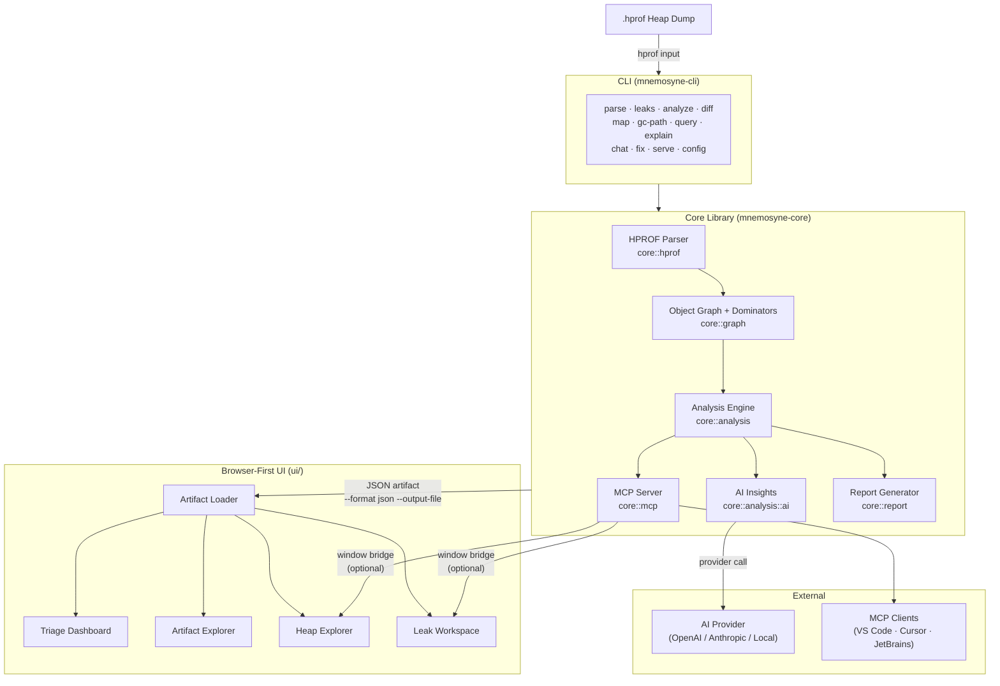

# Project Review, Doc Cleanup & M6 Roadmap Implementation Plan

> **For agentic workers:** REQUIRED SUB-SKILL: Use superpowers:subagent-driven-development (recommended) or superpowers:executing-plans to implement this plan task-by-task. Steps use checkbox (`- [ ]`) syntax for tracking.

**Goal:** Delete stale docs, update ARCHITECTURE.md with the shipped UI layer + inline Mermaid diagram, rewrite roadmap to close M4 and expand M6 with the three residual UI gaps.

**Architecture:** Docs-only changes. No Rust or TypeScript code touched. ARCHITECTURE.md gets a new Browser-First UI Layer section and inline Mermaid diagram (replacing stale SVG references). Roadmap M4 section gets a shipped status rewrite; M6 absorbs three residual gaps. All completed superpowers plans/specs deleted.

**Tech Stack:** Markdown, Mermaid (inline code blocks), git

---

## File Structure

### Files to delete

- `OVERNIGHT_SUMMARY.md` — historical overnight log, fully absorbed by STATUS.md and commit history
- `docs/superpowers/plans/` — all 23 files, all executed and complete
- `docs/superpowers/specs/` — all 18 files, all executed and complete (the new design spec `2026-04-25-project-review-and-m6-roadmap-design.md` stays committed as a record)

### Files to keep

- `docs/superpowers/reviews/2026-04-15-project-review.md` — still useful baseline review

### Files to modify

- `ARCHITECTURE.md`
  - Add Browser-First UI Layer section (after line 68 "Still in progress" block)
  - Replace SVG diagram `img` references in README with note + Mermaid block
  - Update "Still in progress" snapshot
  - Update "Future Extension Points" — remove stale GUI item, add M6 UI gap items
- `docs/roadmap.md`
  - Section 9 Milestone 4 (line 727): rewrite as shipped with residual gaps noted → M6
  - Section 9 Milestone 6 (line 812): add three M4 gaps to scope + new definition of done
  - Section 11 (line 1206 "Remaining Roadmap Order"): replace with M6 as current focus
- `README.md`
  - Update architecture section: remove stale SVG `img` tag, add brief shipped-UI note

---

## Task 1: Delete Stale Files

**Files:**
- Delete: `OVERNIGHT_SUMMARY.md`
- Delete: all files in `docs/superpowers/plans/`
- Delete: all files in `docs/superpowers/specs/` except `2026-04-25-project-review-and-m6-roadmap-design.md`

- [ ] **Step 1: Delete OVERNIGHT_SUMMARY.md**

```bash
rm OVERNIGHT_SUMMARY.md
```

- [ ] **Step 2: Delete all completed plans**

```bash
rm docs/superpowers/plans/2026-04-11-m3-phase3-classloader-oql.md
rm docs/superpowers/plans/2026-04-12-ai-cli-chat.md
rm docs/superpowers/plans/2026-04-12-ai-fix-generation.md
rm docs/superpowers/plans/2026-04-12-ai-mcp-sessions.md
rm docs/superpowers/plans/2026-04-12-ai-privacy-audit-logging.md
rm docs/superpowers/plans/2026-04-12-ai-prompt-templates.md
rm docs/superpowers/plans/2026-04-12-ai-provider-execution.md
rm docs/superpowers/plans/2026-04-12-ai-task-runner.md
rm docs/superpowers/plans/2026-04-12-m5-transport-hardening.md
rm docs/superpowers/plans/2026-04-12-repo-governance-implementation.md
rm docs/superpowers/plans/2026-04-12-step11-dense-synthetic-heaps.md
rm docs/superpowers/plans/2026-04-13-m3-a-small-closeout.md
rm docs/superpowers/plans/2026-04-13-m3-b-docker-cve-triage.md
rm docs/superpowers/plans/2026-04-13-m3-final-closeout.md
rm docs/superpowers/plans/2026-04-13-roadmap-closeout-doc-alignment.md
rm docs/superpowers/plans/2026-04-14-m4-dashboard-first-slice.md
rm docs/superpowers/plans/2026-04-14-m4-leak-workspace.md
rm docs/superpowers/plans/2026-04-15-m4-artifact-explorer-breadth.md
rm docs/superpowers/plans/2026-04-15-m4-competitive-explorer-5a.md
rm docs/superpowers/plans/2026-04-15-m4-competitive-explorer-5b.md
rm docs/superpowers/plans/2026-04-15-m4-context-activation.md
rm docs/superpowers/plans/2026-04-15-m4-gc-path-workflow-hardening.md
rm docs/superpowers/plans/2026-04-15-m4-real-local-detail-bridge.md
```

Verify:
```bash
ls docs/superpowers/plans/ 2>/dev/null && echo "FAIL - files remain" || echo "PASS - directory empty or gone"
```
Expected: `PASS - directory empty or gone`

- [ ] **Step 3: Delete all completed specs (keep new design doc)**

```bash
rm docs/superpowers/specs/2026-04-12-ai-anthropic-transport-design.md
rm docs/superpowers/specs/2026-04-12-ai-cli-chat-design.md
rm docs/superpowers/specs/2026-04-12-ai-fix-generation-design.md
rm docs/superpowers/specs/2026-04-12-ai-mcp-session-design.md
rm docs/superpowers/specs/2026-04-12-ai-prompt-templates-design.md
rm docs/superpowers/specs/2026-04-12-ai-provider-execution-design.md
rm docs/superpowers/specs/2026-04-12-ai-task-runner-design.md
rm docs/superpowers/specs/2026-04-12-m5-transport-hardening-design.md
rm docs/superpowers/specs/2026-04-12-repo-governance-design.md
rm docs/superpowers/specs/2026-04-12-step11-dense-synthetic-heaps-design.md
rm docs/superpowers/specs/2026-04-13-m3-a-small-closeout-design.md
rm docs/superpowers/specs/2026-04-13-m3-b-docker-cve-triage-design.md
rm docs/superpowers/specs/2026-04-13-m3-final-closeout-design.md
rm docs/superpowers/specs/2026-04-13-roadmap-closeout-design.md
rm docs/superpowers/specs/2026-04-14-m4-dashboard-first-slice-design.md
rm docs/superpowers/specs/2026-04-14-m4-leak-workspace-design.md
rm docs/superpowers/specs/2026-04-15-m4-artifact-explorer-breadth-design.md
rm docs/superpowers/specs/2026-04-15-m4-investigation-slices-design.md
```

Verify one remains:
```bash
ls docs/superpowers/specs/
```
Expected: `2026-04-25-project-review-and-m6-roadmap-design.md` only.

- [ ] **Step 4: Commit deletions**

```bash
git add -A
git commit -m "chore: remove stale overnight summary and completed superpowers plans/specs"
```

---

## Task 2: Update ARCHITECTURE.md — Add UI Layer Section

**Files:**
- Modify: `ARCHITECTURE.md`

- [ ] **Step 1: Update the "Still in progress" block (line ~64)**

Find this block in `ARCHITECTURE.md`:

```markdown
### Still in progress
- **Remaining MAT-parity work**, especially deeper query/explorer coverage beyond the current minimal OQL-style surface.
- **Post-M5 AI follow-through** (e.g., broader conversation/exploration semantics, native local-provider transports beyond OpenAI-compatible endpoints, and any streaming follow-through only if later validation proves it necessary).
- **Large-dump follow-through**: Step 11 is complete. The current benchmark baseline now includes dense synthetic validation at roughly 500 MB / 1 GB / 2 GB, with default-path RSS around 2.87x-2.90x and investigation-path RSS around 3.89x-3.92x. Additional real-world large-dump validation is still useful, but the Step 11 gate is no longer open.
- **Formal MCP/task automation around the future analysis pipeline.**
```

Replace with:

```markdown
### Still in progress (M6 scope)
- **Browser UI gaps (moved to M6):** Live object references/referrers in Object Inspector (currently artifact-backed dominator data only); heap-explorer → leak-workspace object-to-leak resolution contract; Tauri desktop packaging.
- **Post-M5 AI follow-through (narrower scope):** Broader conversation/exploration semantics, native local-provider transports beyond OpenAI-compatible endpoints, and streaming only if the current request/response transport proves insufficient.
- **M6 ecosystem:** rustdoc publication, example projects with sample heap dumps, benchmark suite vs MAT, integration guides (GitHub Actions, Jenkins), community infrastructure.
```

- [ ] **Step 2: Add the Browser-First UI Layer section after the Project Structure block**

Find the line that starts with:

```markdown
The sections below describe the intended architecture; status callouts highlight where the current v0.2.0 build diverges so contributors know which pieces still need implementation work.
```

Add the following **after** the Project Structure code block (after the closing ` ``` ` of the `core/` tree):

```markdown

## Browser-First UI Layer

> **Status (Apr 2026):** Shipped as M4. All planned routes and feature slices are complete. Three residual gaps (live object refs, heap→leak jumps, Tauri packaging) are moved to M6.

The `ui/` directory is a browser-first React frontend built with TypeScript and Bun. It is the primary graphical interface for Mnemosyne and is independent of the Rust CLI — it reads pre-generated JSON analysis artifacts and optionally connects to a host-side bridge for live detail.

### Route Map

| Route | Surface | Data source |
|-------|---------|-------------|
| `/` | Artifact loader — drop a JSON artifact or pick a file | — |
| `/dashboard` | Triage dashboard — summary strip, leak table, histogram panel, graph metrics | Artifact |
| `/artifacts/explorer` | Artifact explorer — histogram explorer, analyzer rail, bucket detail | Artifact |
| `/heap-explorer/dominators` | Dominator tree browser — retained-size explorer | Artifact |
| `/heap-explorer/object-inspector` | Object inspector — field values, dominator detail | Artifact |
| `/heap-explorer/query-console` | OQL query console — runs `query_heap` via host bridge | Bridge |
| `/leaks/:leakId/overview` | Leak overview — suspect summary backed by artifact | Artifact |
| `/leaks/:leakId/explain` | AI explanation — routed through host bridge when available | Bridge |
| `/leaks/:leakId/gc-path` | GC path visualizer — bridge-backed with object-target recall | Bridge |
| `/leaks/:leakId/source-map` | Source mapping — bridge-backed | Bridge |
| `/leaks/:leakId/fix` | Fix suggestions — bridge-backed | Bridge |

### Feature Areas

```text
ui/src/features/
├── artifact-loader/     # Drop zone, artifact parsing, artifact Zustand store
├── dashboard/           # Triage dashboard components and dashboard store
├── artifact-explorer/   # Histogram explorer, analyzer rail, bucket detail
├── heap-explorer/       # Dominator/object/query pages + cross-nav actions
└── leak-workspace/      # Leak workspace layout, subpages, live-detail bridge
```

### Host Bridge Contract

Two optional host bridges can be injected by a Tauri or Electron wrapper (or MCP-backed local server):

- `window.__MNEMOSYNE_LEAK_WORKSPACE_BRIDGE__` — provides `explainLeak`, `findGcPath`, `mapToCode`, and `proposeFix`
- `window.__MNEMOSYNE_HEAP_EXPLORER_BRIDGE__` — provides `queryHeap`

When a bridge is absent, affected panels render explicit `unavailable` states instead of synthetic placeholders. Artifact-backed panels always work without any bridge.

### Architecture Diagram



> **Note:** `resources/architecture-overview.svg` and `resources/architecture.svg` are pre-rendered Mermaid exports that predate the UI layer. The diagram above is the authoritative current architecture. The SVG files can be regenerated from a Mermaid source if needed for export.
```

- [ ] **Step 3: Update "Future Extension Points" — remove stale GUI item, add M6 UI gaps**

Find this paragraph in `ARCHITECTURE.md`:

```markdown
**GUI or Web Dashboard**: Build a graphical user interface on top of Mnemosyne. This could be a desktop electron app or a web dashboard that allows users to upload a heap dump and get a nicely formatted report with charts (e.g., pie chart of memory by package, timeline of object count if multiple dumps tracked, etc.). The core logic would remain the same, just a new presentation layer on top.
```

Replace with:

```markdown
**Browser-First UI (shipped, M4)**: The `ui/` React frontend is complete. It ships artifact-backed triage, artifact explorer, heap explorer (dominators, object inspector, query console), and the full leak workspace route family. Three residual gaps are tracked in M6: live object references/referrers in the Object Inspector, heap-explorer → leak-workspace object-to-leak resolution, and Tauri desktop packaging.

**Tauri Desktop Packaging (M6)**: Wrap the existing `ui/` React frontend in a Tauri shell for distribution as a native desktop app. The host bridge contract (`window.__MNEMOSYNE_LEAK_WORKSPACE_BRIDGE__`, `window.__MNEMOSYNE_HEAP_EXPLORER_BRIDGE__`) is already defined and ready for a Tauri implementation.

**Live Object References/Referrers (M6)**: The Object Inspector currently shows artifact-backed dominator data only. Extending the host bridge to expose `getReferences(objectId)` and `getReferrers(objectId)` — using the already-shipped `ObjectGraph` navigation API (`get_references`, `get_referrers`) — would enable live drill-down into an object's reference graph from the browser.

**Heap-Explorer → Leak-Workspace Jumps (M6)**: There is currently no object-to-leak resolution contract. Adding an artifact-backed or host-backed mapping from object ID to leak suspect ID would enable direct navigation from any heap explorer view into the relevant leak workspace.
```

- [ ] **Step 4: Verify ARCHITECTURE.md renders correctly**

```bash
grep -n "Browser-First UI Layer\|Mermaid\|mermaid\|Still in progress\|Tauri\|Live Object" ARCHITECTURE.md | head -20
```

Expected: lines for the new section, diagram, and M6 items are present.

- [ ] **Step 5: Commit ARCHITECTURE.md changes**

```bash
git add ARCHITECTURE.md
git commit -m "docs(arch): add browser-first UI layer section, inline Mermaid diagram, update M6 extension points"
```

---

## Task 3: Update README.md Architecture Section

**Files:**
- Modify: `README.md`

- [ ] **Step 1: Replace stale SVG reference with shipped UI note**

Find this block in `README.md`:

```markdown
## 🌐 Architecture


```

Replace with:

```markdown
## 🌐 Architecture

See [ARCHITECTURE.md](ARCHITECTURE.md) for the full architecture description including the browser-first UI layer, inline Mermaid diagram, and M6 extension points.

**Layers at a glance:**
- **CLI** (`mnemosyne-cli`) — `parse`, `leaks`, `analyze`, `diff`, `map`, `gc-path`, `query`, `explain`, `chat`, `fix`, `serve`, `config`
- **Core** (`mnemosyne-core`) — HPROF parser, object graph, dominators, analysis engine, AI insights, MCP server, report generator
- **Browser UI** (`ui/`) — React frontend: artifact loader, triage dashboard, artifact explorer, heap explorer, leak workspace
- **MCP** — 14 methods for IDE integration (VS Code, Cursor, JetBrains, ChatGPT Desktop)
- **AI** — `rules` (default offline), `stub`, and `provider` (OpenAI-compatible / Anthropic) modes
```

- [ ] **Step 2: Verify README renders correctly**

```bash
grep -n "Architecture\|Layers at a glance\|architecture-overview.svg" README.md | head -10
```

Expected: `architecture-overview.svg` reference gone; `Layers at a glance` present.

- [ ] **Step 3: Commit README changes**

```bash
git add README.md
git commit -m "docs(readme): replace stale architecture SVG with shipped UI summary and arch link"
```

---

## Task 4: Update Roadmap — Close M4, Expand M6

**Files:**
- Modify: `docs/roadmap.md`

- [ ] **Step 1: Rewrite Milestone 4 section (line 727)**

Find the Milestone 4 section starting at:

```markdown
### Milestone 4 — UI & Usability

> **Design Reference:** [docs/design/milestone-4-ui-and-usability.md](design/milestone-4-ui-and-usability.md)

**Objective:** Make Mnemosyne visually accessible to developers who prefer graphical exploration.
```

Replace the entire Milestone 4 section (from `### Milestone 4` down to the `---` before Milestone 5) with:

```markdown
### Milestone 4 — UI & Usability ✅ Complete

> **Design Reference:** [docs/design/milestone-4-ui-and-usability.md](design/milestone-4-ui-and-usability.md)
> **Closed:** 2026-04-25

**Objective:** Make Mnemosyne visually accessible to developers who prefer graphical exploration.

**Shipped deliverables:**
1. ✅ Browser-first React frontend under `ui/` — Bun-backed scripts, local JSON artifact loading
2. ✅ Triage dashboard — summary strip, leak table, histogram panel, graph metrics panel, provenance badges
3. ✅ Artifact explorer — histogram explorer with analyzer rail (strings, collections, unreachable, top instances, classloaders) and selected-bucket detail
4. ✅ Heap explorer — dominator tree browser, object inspector (artifact-backed), OQL query console (bridge-backed)
5. ✅ Leak workspace route family — `/leaks/:leakId/{overview,explain,gc-path,source-map,fix}` with artifact-backed overview and bridge-backed live-detail routes
6. ✅ Host bridge contracts — `window.__MNEMOSYNE_LEAK_WORKSPACE_BRIDGE__` and `window.__MNEMOSYNE_HEAP_EXPLORER_BRIDGE__` defined with honest `ready`/`fallback`/`unavailable` states
7. ✅ Context activation — `projectRoot` and `objectId` controls in the leak workspace shell, route-seeded leak identity, per-leak recent object-target history with GC-path recall
8. ✅ Cross-navigation — dominator/object/query explorer cross-nav actions between heap explorer panes
9. ✅ 143 passing frontend tests (Bun test runner)

**Residual gaps — moved to M6:**
1. **Live object references/referrers** — Object Inspector currently shows artifact-backed dominator data only; live refs/referrers require extending the host bridge with `getReferences`/`getReferrers`
2. **Heap-explorer → leak-workspace jumps** — no object-to-leak resolution contract exists; needs artifact-backed or host-backed mapping from object ID to leak suspect ID
3. **Tauri desktop packaging** — host bridge contract is ready; Tauri wrapper is the remaining step for native desktop distribution

**Dependencies met:** M1 (object graph ✅), M3 (analysis features ✅)

---
```

- [ ] **Step 2: Expand Milestone 6 section (line 812)**

Find the Milestone 6 section starting at:

```markdown
### Milestone 6 — Ecosystem & Community

> **Design Reference:** [docs/design/milestone-6-ecosystem-and-community.md](design/milestone-6-ecosystem-and-community.md)

**Objective:** Build the community and ecosystem that makes Mnemosyne self-sustaining.
```

Replace the entire Milestone 6 section (from `### Milestone 6` to the `---` after it) with:

```markdown
### Milestone 6 — Ecosystem, Community & UI Completion

> **Design Reference:** [docs/design/milestone-6-ecosystem-and-community.md](design/milestone-6-ecosystem-and-community.md)

**Objective:** Build the community and ecosystem that makes Mnemosyne self-sustaining, and complete the three residual UI gaps carried over from M4.

**Why UI gaps belong here:** The three M4 residual gaps (live refs, heap→leak jumps, Tauri) each require cross-cutting decisions about the host bridge contract or native packaging. They are discrete, well-scoped slices that fit naturally alongside the ecosystem hardening work rather than re-opening M4.

**Key Deliverables — UI Completion (from M4):**
1. **Live object references/referrers** — extend `window.__MNEMOSYNE_LEAK_WORKSPACE_BRIDGE__` / `window.__MNEMOSYNE_HEAP_EXPLORER_BRIDGE__` with `getReferences(objectId)` and `getReferrers(objectId)`; wire into Object Inspector using the already-shipped `ObjectGraph.get_references()` / `get_referrers()` Rust API; display refs/referrers as navigable lists with cross-nav actions into dominator view
2. **Heap-explorer → leak-workspace resolution** — define an artifact-backed or host-backed `resolveObjectToLeak(objectId)` contract; enable cross-nav actions in dominator/object/query panes that jump directly into the relevant leak workspace overview
3. **Tauri desktop packaging** — implement the two bridge interfaces (`LeakWorkspaceHostBridge`, `HeapExplorerBridge`) in a Rust Tauri backend using `core::mcp` handlers; bundle as a native desktop app for macOS, Linux, and Windows; add Tauri build to CI release workflow

**Key Deliverables — Ecosystem & Community:**
4. Comprehensive rustdoc published to docs.rs or GitHub Pages
5. Example projects — 3+ sample Java apps with known memory issues and committed heap dumps
6. Benchmark suite — reproducible perf benchmarks vs Eclipse MAT and heaptrack
7. CI integration guide — GitHub Actions workflow, Jenkins pipeline, GitLab CI examples
8. User guide / tutorials — getting started, CLI reference, MCP integration, AI provider setup
9. Community infrastructure — Discord or Slack, contributor guide, issue triage process
10. Plugin/extension system design — custom analyzers, output formats, LLM backends

**Dependencies:** M1-M5 complete ✅, M4 shipped ✅

**Modules/files affected:** `ui/src/features/heap-explorer/`, `ui/src/features/leak-workspace/`, new `tauri/` directory, `docs/`, `examples/`, `.github/`

**Complexity:** Medium-High (Tauri is the most complex new piece; ecosystem work is mostly documentation and content)

**Implementation order:**
1. Live object references/referrers (smallest bridge extension, high value)
2. Heap-explorer → leak-workspace resolution (depends on bridge patterns from #1)
3. rustdoc + user guide (ecosystem foundation)
4. Example projects + sample dumps
5. CI integration guide
6. Tauri desktop packaging (largest piece, needs stable bridge contract from #1 and #2)
7. Benchmark suite vs MAT
8. Plugin/extension system design
9. Community channels + content creation

**Definition of done:**
- Object Inspector shows live references and referrers when bridge present
- Can jump from any heap explorer view directly into the related leak workspace
- Tauri app distributes via GitHub Releases for macOS/Linux/Windows
- rustdoc published and linked from README
- 3+ example projects with heap dumps committed to `examples/`
- CI integration guide covers GitHub Actions + one other CI system
- Active community channel with documented triage process

---
```

- [ ] **Step 3: Update Section 11 "Remaining Roadmap Order" (line ~1206)**

Find:

```markdown
### Remaining Roadmap Order
The remaining roadmap should now execute in this order:
1. **Small remaining M3 closeout work** — README badge qualifier, real usage examples, IntelliJ stacktrace compatibility, and benchmark/query follow-through only where still justified
2. **M4 (UI & Usability)** — the next full open milestone: interactive HTML reports plus a browser-first local UI on top of shipped M3/M5 capabilities; the loader, triage dashboard, and leak workspace route family now exist, but the milestone remains open for broader explorer coverage and stronger live-detail context seeding
3. **M5 follow-on only where evidence supports it** — broader conversation/exploration semantics, native local-provider transports beyond OpenAI-compatible endpoints, and transport streaming only if the current request/response contract proves insufficient
4. **M6 (Ecosystem & Community)** — docs, examples, benchmarks, integrations, and community infrastructure after M4 and any justified M5 follow-on
```

Replace with:

```markdown
### Current Focus: M6

**M1 ✅ M1.5 ✅ M2 ✅ M3 ✅ M4 ✅ M5 ✅ — M6 is the active milestone.**

M6 combines the original ecosystem/community program with three residual UI gaps from M4. Start with the UI gaps (they are the smallest, highest-value items and unblock Tauri):

1. **Live object references/referrers** — extend the host bridge, wire into Object Inspector, add cross-nav
2. **Heap-explorer → leak-workspace resolution** — define the object-to-leak contract, enable cross-nav jumps
3. **rustdoc + user guide** — ecosystem foundation that unblocks community work
4. **Example projects + CI guide** — concrete usage evidence
5. **Tauri desktop packaging** — requires stable bridge contract from items 1 and 2
6. **Benchmark suite, plugin design, community** — final ecosystem program

See [Milestone 6](#milestone-6--ecosystem-community--ui-completion) for full scope and definition of done.
```

- [ ] **Step 4: Update the roadmap header "Last updated" date**

Find:

```markdown
> **Last updated:** 2026-04-14 (roadmap/design alignment for shipped M3, approved-scope M5, and current M4 browser-first slice)
```

Replace with:

```markdown
> **Last updated:** 2026-04-25 (M4 closed, M6 expanded with three M4 residual gaps, stale plans/specs cleaned up)
```

- [ ] **Step 5: Verify roadmap changes**

```bash
grep -n "✅ Complete\|Residual gaps\|M6 is the active\|Live object references\|Tauri desktop\|2026-04-25" docs/roadmap.md | head -20
```

Expected: all six patterns found with correct line numbers.

- [ ] **Step 6: Commit roadmap changes**

```bash
git add docs/roadmap.md
git commit -m "docs(roadmap): close M4, move residual UI gaps to M6, set M6 as active milestone"
```

---

## Task 5: Final Verification

- [ ] **Step 1: Run full Rust test suite**

```bash
cargo test
```

Expected: all 228 tests pass (doc-only changes, no Rust modified).

- [ ] **Step 2: Run UI test suite**

```bash
cd ui && npx --yes bun run test
```

Expected: 143 pass, 0 fail.

- [ ] **Step 3: Check no broken internal doc links**

```bash
grep -r "OVERNIGHT_SUMMARY\|superpowers/plans/2026-04-1[1-5]\|superpowers/specs/2026-04-1[2-5]" docs/ README.md ARCHITECTURE.md STATUS.md CHANGELOG.md 2>/dev/null | grep -v "2026-04-25"
```

Expected: no output (no remaining references to deleted files).

- [ ] **Step 4: Check docs/roadmap.md references to deleted spec files**

```bash
grep "superpowers/specs" docs/roadmap.md | head -10
```

These lines (Step 14 design addendums in Section 11) reference deleted spec files. Update each one to remove the broken link, keeping just the descriptive text:

Find in `docs/roadmap.md`:

```markdown
**Design addendum:** `docs/superpowers/specs/2026-04-12-ai-prompt-templates-design.md`
**Design addendum:** `docs/superpowers/specs/2026-04-12-ai-anthropic-transport-design.md`
**Design addendum:** `docs/superpowers/specs/2026-04-12-ai-cli-chat-design.md`
```

Replace with:

```markdown
**Design addendum:** Prompt templates, Anthropic transport, and CLI chat design specs (completed — see commit history for specs)
```

- [ ] **Step 5: Commit broken-link cleanup**

```bash
git add docs/roadmap.md
git commit -m "docs(roadmap): remove broken spec links after completed specs deleted"
```

- [ ] **Step 6: Final git log check**

```bash
git log --oneline -6
```

Expected: 5 commits from this session visible:
1. `chore: remove stale overnight summary and completed superpowers plans/specs`
2. `docs(arch): add browser-first UI layer section, inline Mermaid diagram, update M6 extension points`
3. `docs(readme): replace stale architecture SVG with shipped UI summary and arch link`
4. `docs(roadmap): close M4, move residual UI gaps to M6, set M6 as active milestone`
5. `docs(roadmap): remove broken spec links after completed specs deleted`
